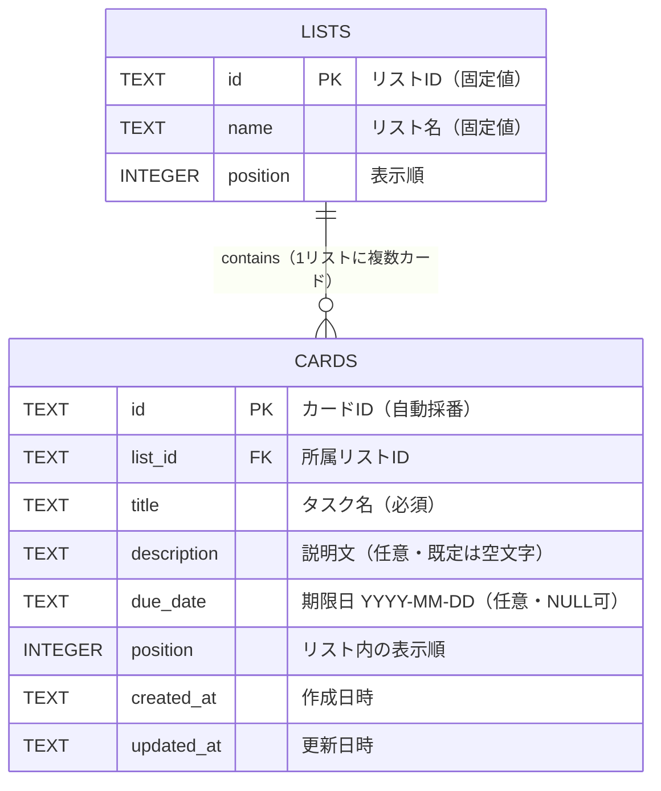

# TaskFlow 要件定義書

| 項目 | 内容 |
|---|---|
| アプリ名 | TaskFlow |
| バージョン | 2.0 |
| 作成日 | 2026-05-25 |
| 最終更新日 | 2026-06-09 |
| 作成者 | 個人開発（Raise Tech AIエンジニアコース 受講課題） |
| ドキュメント種別 | 要件定義書 |

> **v2.0 における方針変更**：データ保存方式を localStorage から「**自前バックエンド（Node.js + Express）＋ データベース（SQLite）**」構成に変更した。これに伴い、本アプリはフロントエンドとバックエンドの2階建て（クライアント／サーバー型）構成となる。マルチユーザ対応・認証は本プロジェクトのスコープ外とする。

---

## 1. プロジェクト概要

### 1.1 目的
個人の日常タスクを視覚的に整理し、進捗状況と期限を一目で把握できるようにする、Trello風のシンプルなタスク管理Webアプリケーション「**TaskFlow**」を開発する。

### 1.2 背景
頭の中だけでタスクを管理していると、以下のような問題が発生する。

- やるべきタスクの全体像が見えず、漏れが発生する
- 何が進行中で何が完了したのかが曖昧になる
- 締め切りを忘れてしまう

これらを解決するため、ブラウザ上で手軽に使えるタスクボードを自作する。

### 1.3 学習目的（課題としての位置づけ）
本プロジェクトは Raise Tech AIエンジニアコースの課題として、以下の学習を目的とする。

- 要件定義から実装・公開までの一連のWeb開発工程を経験する
- HTML / CSS / JavaScript（バニラ）の基礎を実践的に習得する
- **クライアント／サーバー型のWebアプリ構成（フロントエンド・バックエンド・DB）を理解する**
- **Node.js + Express による REST API の設計・実装を学ぶ**
- **SQLite と SQL によるデータ永続化、およびテーブル設計（ER図）を学ぶ**
- **`fetch` を用いたフロントエンドとバックエンド間の非同期通信を学ぶ**
- HTML5 Drag and Drop API を用いたインタラクションを実装する
- Git / GitHub を用いた成果物の公開と管理を行う

---

## 2. ターゲットユーザー

| 項目 | 内容 |
|---|---|
| 想定ユーザー | 開発者本人（個人利用・単一ユーザ） |
| 利用シーン | 日常タスク・学習タスク・プライベートのToDo管理 |
| 利用端末 | PC（デスクトップ・ノートPC） |
| 想定利用頻度 | ほぼ毎日 |

---

## 3. 解決したい課題

| # | 課題 | 本アプリでの解決方針 |
|---|---|---|
| 1 | タスクが頭の中だけだと漏れる | カード形式でリスト上に可視化する |
| 2 | 進捗状況が曖昧になる | 「未着手 / 進行中 / 完了」の3列で進捗を明示 |
| 3 | 締め切りを忘れる | カードに期限日を設定し、期限切れは赤色で強調表示 |

---

## 4. 前提条件・制約条件

要件を満たすうえで「成り立っているものとして扱う事柄（前提条件）」と「変更できない縛り（制約条件）」を明示する。これらが崩れた場合、仕様や動作保証の範囲が変わる。

### 4.1 前提条件

| # | 前提条件 |
|---|---|
| A-1 | 利用者は1名（開発者本人）であり、認証・同時編集は発生しない |
| A-2 | 利用環境に Node.js（LTS版）がインストールされている |
| A-3 | 利用者はアプリ起動時にバックエンドサーバーを起動してから利用する |
| A-4 | フロントエンドとバックエンドは同一マシン上（localhost）で動作する（外部公開デプロイは任意） |
| A-5 | 利用ブラウザで JavaScript が有効になっている |

### 4.2 制約条件

| # | 制約条件 | 理由 |
|---|---|---|
| C-1 | フロントエンドはバニラJS（フレームワーク不使用）とする | フロント基礎技術の習得が学習目的のため |
| C-2 | バックエンドは Node.js + Express、データベースは SQLite を使用する | フルスタック構成の習得のため |
| C-3 | DBアクセスは生SQL（`better-sqlite3` 等）で行い、SQLインジェクション対策としてパラメータ化クエリを用いる | SQLの基礎習得と安全性確保のため |
| C-4 | マルチユーザ対応・認証・権限管理は実装しない | 学習スコープを限定するため |
| C-5 | スマートフォン・タブレット専用の最適化は行わない | スコープを学習範囲に限定するため |
| C-6 | 開発工数は受講スケジュールの範囲内とする | 課題としての制約 |

---

## 5. 機能要件

### 5.1 機能一覧（全体）

| ID | 機能名 | Phase | 優先度 |
|---|---|---|---|
| F-01 | 3つの固定リスト表示 | Phase 1 | 必須 |
| F-02 | カード追加 | Phase 1 | 必須 |
| F-03 | カード削除 | Phase 1 | 必須 |
| F-04 | カードのドラッグ＆ドロップ移動 | Phase 1 | 必須 |
| F-05 | バックエンドAPI経由のデータ保存・復元（SQLite） | Phase 1 | 必須 |
| F-06 | カードのタスク名編集 | Phase 2 | 必須 |
| F-07 | カードの説明文設定・編集 | Phase 2 | 必須 |
| F-08 | カードの期限（締切日）設定 | Phase 2 | 必須 |
| F-09 | 期限切れカードの赤色強調表示 | Phase 2 | 必須 |

### 5.2 各機能の詳細

#### F-01 3つの固定リスト表示
- 画面上に「未着手」「進行中」「完了」の3つのリスト（列）を横並びで表示する
- リスト名・リスト数は固定とし、ユーザーは変更・追加・削除できない
- リストはDBの `lists` テーブルにあらかじめ登録された固定データとして扱う

#### F-02 カード追加
- 各リストの末尾に「＋カードを追加」ボタンを配置する
- ボタン押下で入力フィールドが表示され、タスク名を入力して確定するとカードがリストに追加される
- 確定時にAPI（`POST /api/cards`）を呼び出し、DBに保存したうえで画面に反映する
- タスク名が空の場合は追加しない（クライアント・サーバー双方で検証）

#### F-03 カード削除
- 各カードに削除ボタン（×）を表示する
- 押下時に確認ダイアログを表示し、OKでAPI（`DELETE /api/cards/:id`）を呼び出して削除する

#### F-04 カードのドラッグ＆ドロップ移動
- HTML5 Drag and Drop API を用いて実装する
- リスト間の移動、および同一リスト内での並び替えを可能とする
- ドロップ確定時にAPI（`PATCH /api/cards/:id/move`）を呼び出し、所属リスト（`list_id`）と並び順（`position`）を更新する
- 外部ライブラリは使用しない

#### F-05 バックエンドAPI経由のデータ保存・復元
- カード追加・編集・削除・移動のいずれの操作も、API経由でバックエンドに送信し、SQLiteへ永続化する
- アプリ起動時にAPI（`GET /api/board`）からリスト・カードを取得し、画面に反映する
- データがない場合は、空のリスト3つを表示する（サンプルカードは表示しない）
- サーバーを再起動してもデータが保持されること

#### F-06 カードのタスク名編集
- カードをクリックすると詳細編集UI（モーダルまたはインライン）が開き、タスク名を変更できる
- 保存時にAPI（`PUT /api/cards/:id`）を呼び出して更新する

#### F-07 カードの説明文設定・編集
- カード詳細編集UIで、自由記述の説明文（複数行可）を入力・編集できる
- 説明文は任意項目とする

#### F-08 カードの期限設定
- カード詳細編集UIで、期限日（年月日）を設定できる
- 期限は任意項目とする
- 日付入力には `<input type="date">` を使用する

#### F-09 期限切れカードの赤色強調表示
- カードに設定された期限が当日より過去の場合、カードの背景または枠を赤色で表示する
- 「完了」リストにあるカードは期限切れでも強調しない

### 5.3 異常系仕様

正常な操作（正常系）に対し、入力ミス・通信失敗・サーバー側エラーなど「想定外だが起こりうる状況」を**異常系**と呼ぶ。クライアント／サーバー構成になったことで、**通信エラーやサーバー側エラー**が新たに加わる。

| # | 発生条件 | 期待する挙動 |
|---|---|---|
| E-01 | タスク名が空（または空白のみ）で追加・更新 | クライアント側で送信前に検証。万一サーバーに届いた場合も 400 を返す。画面は「タスク名を入力してください」を表示 |
| E-02 | タスク名・説明文が想定文字数を大きく超える | 最大文字数（例：タスク名100字、説明文1000字）を超える分は受け付けない。サーバー側でも上限を検証 |
| E-03 | 不正な日付（形式不正など） | `<input type="date">` の制御に従う。空（未設定）に戻すことも可能とする |
| E-04 | DBへの書き込み失敗（SQLエラー等） | サーバーは 500 を返し、エラー内容をログに記録。クライアントは「保存に失敗しました」を通知し、画面の状態は直前を保つ |
| E-05 | サーバー起動失敗・DBファイル破損 | サーバー側でエラーをログ出力し、起動を中止。利用者は原因を確認できる |
| E-06 | API通信失敗（サーバー未起動・ネットワーク断） | クライアントで通信エラーを検知し「サーバーに接続できません」を通知。操作は確定させない |
| E-07 | ドラッグ操作をリスト外（無効領域）でドロップ／途中でキャンセル | カードは元の位置に戻す。APIは呼ばず、データは変更しない |
| E-08 | 削除確認ダイアログでキャンセルを選択 | 削除を行わず、元の状態を維持する |
| E-09 | 存在しないカードIDへの操作（404）／不正なリクエスト（400） | サーバーは適切なHTTPステータスを返す。クライアントは通知し、必要に応じて画面を最新状態へ再取得する |

---

## 6. 非機能要件

機能そのものではなく、「どの程度の品質・条件で動くべきか」を定める要件。

### 6.1 対応環境

| 項目 | 内容 |
|---|---|
| 対応OS | Windows / macOS（PC） |
| サーバー実行環境 | Node.js（LTS版） |
| 対応ブラウザ | Chrome / Edge / Firefox（いずれも最新版） |
| アクセス方法 | サーバー起動後、ブラウザで `http://localhost:<ポート>` にアクセス |
| 画面サイズ | PC画面想定（1280px以上を主たるターゲット） |
| スマホ対応 | 対応しない（スコープ外） |

### 6.2 デザイン要件
- Trello風の見た目を踏襲する
- 背景：青系のベースカラー
- カード：白背景
- 全体的にシンプル・視認性重視

### 6.3 性能要件
- 個人利用を前提とし、カード総数が数十〜数百程度の範囲で快適に動作すること
- ページ初期表示（`GET /api/board` を含む）は2秒以内を目標とする
- カード操作（追加・移動・削除）のAPI応答は体感で即時（目安0.5秒以内）とする

### 6.4 データ要件・データ保全
- データはバックエンドが管理する SQLite データベースファイル（例：`taskflow.db`）に保存する
- データベースファイルはサーバー実行マシンのローカルに置く
- バックアップは当該DBファイルをコピーすることで取得できる（運用としてREADMEに明記）
- リスト（未着手／進行中／完了）は初期データとしてDBに投入する（マイグレーション or 初期化スクリプト）

### 6.5 ユーザビリティ要件
- 主要操作（カード追加・移動・編集・削除）は、説明書なしで直感的に行えること
- 破壊的操作（削除）には確認ステップを設けること
- 操作の結果（保存成功・失敗、通信エラー等）がユーザーに分かる形でフィードバックされること

### 6.6 アクセシビリティ要件（努力目標）
- 文字色と背景色のコントラストを確保し、読みやすさを担保する
- 期限切れの表現を「色のみ」に依存させず、テキストやアイコン等の補助表現も検討する（色覚特性への配慮）
- セマンティックなHTMLタグを用いる

### 6.7 セキュリティ要件
- **SQLインジェクション対策**：DBアクセスは必ずパラメータ化クエリ（プレースホルダ）を用い、ユーザー入力をSQL文へ直接連結しない
- **XSS対策**：ユーザー入力（タスク名・説明文）を画面に表示する際はテキストとして表示し、HTMLとして解釈させない
- バックエンドは外部公開せず、ローカル（localhost）での利用を前提とする
- 認証・個人情報・機密情報は扱わない（取り扱う場合はスコープ外）
- DB接続情報や設定値はソースに直書きせず、必要に応じて環境変数で管理する

### 6.8 保守性要件
- フロントエンド（HTML/CSS/JS）とバックエンド（サーバー/DB）をディレクトリ単位で明確に分離する
- 変数・関数・APIエンドポイントは意味の分かる命名とし、主要処理にはコメントを付す
- DBスキーマ（テーブル定義）・API仕様・起動手順を README に記載する

---

## 7. 技術スタック

| 区分 | 採用技術 | 備考 |
|---|---|---|
| マークアップ | HTML5 | セマンティックタグを活用 |
| スタイル | CSS3 | Flexbox / Grid を使用 |
| フロントスクリプト | JavaScript（ES6+） | バニラJS。`fetch` でAPI連携 |
| ドラッグ操作 | HTML5 Drag and Drop API | 外部ライブラリ不使用 |
| バックエンド | Node.js + Express | REST API サーバー |
| データベース | SQLite | ファイルベースのRDB |
| DBアクセス | 生SQL（`better-sqlite3` 等） | パラメータ化クエリを使用 |
| API形式 | REST（JSON over HTTP） | — |
| バージョン管理 | Git / GitHub | リポジトリで公開 |

---

## 8. システム構成（アーキテクチャ）

本アプリはフロントエンド・バックエンド・データベースの3層からなる、クライアント／サーバー型構成とする。

```
┌─────────────────────┐    HTTP / JSON     ┌──────────────────────────┐    SQL    ┌──────────────┐
│  フロントエンド        │  ───(REST API)──▶  │  バックエンド             │ ───────▶  │  データベース   │
│  ブラウザ              │                    │  Node.js + Express       │           │  SQLite       │
│  HTML / CSS / JS      │  ◀──JSONで応答───   │  ルーティング・検証・SQL   │  ◀──────  │  lists/cards  │
│  fetch() でAPIを呼ぶ   │                    │                          │           │  テーブル      │
└─────────────────────┘                    └──────────────────────────┘           └──────────────┘
        画面表示・操作                              業務ロジック・データ整合性                  永続化
```

- **フロントエンド**：画面表示とユーザー操作を担当。データは自分で保持せず、必要の都度APIに問い合わせる。
- **バックエンド**：APIリクエストを受け取り、入力検証・SQL実行・結果のJSON返却を担当。
- **データベース**：データの永続的な保存先。サーバーのみがアクセスする。

---

## 9. データ設計

### 9.1 ER図

実体（テーブル）とその関係を示す。**1つのリストは複数のカードを持つ（1対多／1:N）** の関係になる。



> 記号の意味：`||--o{` は「左（1）に対して右が0個以上（多）」を表す。`PK`＝主キー（行を一意に識別する列）、`FK`＝外部キー（他テーブルの主キーを参照する列）。

### 9.2 テーブル定義（DDL）

```sql
-- リスト（未着手 / 進行中 / 完了 の3件を初期データとして投入）
CREATE TABLE lists (
  id        TEXT    PRIMARY KEY,   -- 例: 'list-todo'
  name      TEXT    NOT NULL,      -- 例: '未着手'
  position  INTEGER NOT NULL       -- 表示順（0,1,2）
);

-- カード
CREATE TABLE cards (
  id          TEXT    PRIMARY KEY,            -- 例: 'card-xxxxx'
  list_id     TEXT    NOT NULL,               -- 所属リスト（lists.id を参照）
  title       TEXT    NOT NULL,               -- タスク名
  description TEXT    NOT NULL DEFAULT '',     -- 説明文（空文字許容）
  due_date    TEXT,                           -- 期限日 'YYYY-MM-DD'（未設定は NULL）
  position    INTEGER NOT NULL,               -- リスト内の表示順
  created_at  TEXT    NOT NULL,               -- 作成日時（ISO文字列）
  updated_at  TEXT    NOT NULL,               -- 更新日時（ISO文字列）
  FOREIGN KEY (list_id) REFERENCES lists(id)
);
```

### 9.3 設計上の補足
- **`position` 列**：localStorageでは配列の並び順で表現していたカードの順序を、DBでは明示的な数値列で管理する。ドラッグ＆ドロップ（F-04）での並び替えはこの値を更新して実現する。
- **`created_at` / `updated_at`**：作成・更新日時。学習として「監査用の基本列」を持たせる意図。実装簡略化のため省略しても可。
- **ID採番**：文字列IDをサーバー側で生成する（例：`card-` + 連番やUUID）。

---

## 10. API仕様

フロントエンドとバックエンドの通信窓口。すべてリクエスト／レスポンスのボディは JSON とする。

| メソッド | パス | 用途 | 主なリクエスト | 主なレスポンス |
|---|---|---|---|---|
| GET | `/api/board` | 全リストと所属カードを取得（初期表示用） | なし | `{ lists: [{ id, name, position, cards: [...] }] }` |
| POST | `/api/cards` | カードを追加 | `{ listId, title }` | 追加されたカード（201） |
| PUT | `/api/cards/:id` | カードの内容を更新 | `{ title, description, dueDate }` | 更新後のカード（200） |
| PATCH | `/api/cards/:id/move` | カードを移動／並び替え | `{ listId, position }` | 更新後のカード（200） |
| DELETE | `/api/cards/:id` | カードを削除 | なし | 204（No Content） |

### 10.1 HTTPステータスの方針
- `200 OK` / `201 Created` / `204 No Content`：正常
- `400 Bad Request`：入力検証エラー（例：タイトル空・文字数超過）
- `404 Not Found`：指定IDのカードが存在しない
- `500 Internal Server Error`：サーバー内部・DBエラー

### 10.2 エラーレスポンス形式（例）
```json
{ "error": { "code": "VALIDATION_ERROR", "message": "タスク名を入力してください" } }
```

---

## 11. 画面設計

### 11.1 画面一覧
本アプリは単一画面構成（SPA的だがルーティングは不要）。

| 画面ID | 画面名 | 概要 |
|---|---|---|
| S-01 | メイン画面（ボード画面） | 3つのリストとカードを表示するメイン画面 |
| S-02 | カード詳細編集UI | タスク名・説明文・期限を編集する小画面（モーダル想定） |

### 11.2 画面構成イメージ（テキスト版ワイヤーフレーム）

```
┌─────────────────────────────────────────────────────────┐
│ TaskFlow                                                │ ← ヘッダー
├─────────────────────────────────────────────────────────┤
│ ┌──────────┐  ┌──────────┐  ┌──────────┐                │
│ │ 未着手    │  │ 進行中    │  │ 完了      │                │
│ ├──────────┤  ├──────────┤  ├──────────┤                │
│ │ [カード1] │  │ [カード3] │  │ [カード5] │                │
│ │ [カード2] │  │ [カード4] │  │           │                │
│ │ ＋追加    │  │ ＋追加    │  │ ＋追加    │                │
│ └──────────┘  └──────────┘  └──────────┘                │
└─────────────────────────────────────────────────────────┘
```

### 11.3 カード詳細編集UI（S-02）イメージ

```
        ┌───────────────────────────────┐
        │ カードの編集              [×]  │
        ├───────────────────────────────┤
        │ タスク名                       │
        │ ┌───────────────────────────┐ │
        │ │ 買い物に行く               │ │
        │ └───────────────────────────┘ │
        │ 説明                           │
        │ ┌───────────────────────────┐ │
        │ │ 牛乳、卵、パン             │ │
        │ │                           │ │
        │ └───────────────────────────┘ │
        │ 期限   [ 2026-05-30 ▼ ]        │
        │                                │
        │        [ 保存 ]   [ キャンセル ]│
        └───────────────────────────────┘
```

### 11.4 画面遷移図

```
        ┌──────────────────────────┐
        │  S-01 メイン画面（ボード） │ ◀── アプリ起動（GET /api/board でデータ取得）
        └──────────────────────────┘
            │   ▲            │   ▲
   カード   │   │ 保存/      │   │ 閉じる(×)/
   クリック │   │ キャンセル │   │ 領域外クリック
            ▼   │            ▼   │
        ┌──────────────────┐  ┌──────────────────┐
        │ S-02 カード詳細   │  │ 削除確認ダイアログ │
        │ 編集UI（モーダル）│  │（OK/キャンセル）   │
        └──────────────────┘  └──────────────────┘
```

### 11.5 ユーザー操作フロー

**フロー1：カードを追加する**
```
1. 対象リストの「＋カードを追加」を押す
2. 入力欄が表示される
3. タスク名を入力する
   ├─ 空のまま確定 → 追加されない（E-01）
   └─ 入力あり    → 4 へ
4. 確定（POST /api/cards を送信）
   ├─ 成功 → カードがリスト末尾に表示される
   └─ 失敗 → エラー通知（E-04 / E-06）
```

**フロー2：カードを別のリストへ移動する（進捗更新）**
```
1. 対象カードをドラッグし始める
2. 移動先のリスト上へドラッグする
3. ドロップする
   ├─ 有効なリスト上     → PATCH /api/cards/:id/move を送信し移動を確定
   └─ 無効領域/キャンセル → 元の位置に戻る（E-07、APIは呼ばない）
```

**フロー3：期限を設定し、期限切れを確認する**
```
1. カードをクリックして詳細編集UI（S-02）を開く
2. 期限欄で日付を選択する
3. 「保存」を押す → PUT /api/cards/:id を送信、モーダルを閉じる
4. 期限が当日より前の場合、メイン画面でカードが赤色強調される
   （ただし「完了」リストのカードは強調しない：F-09）
```

**フロー4：カードを削除する**
```
1. カードの削除ボタン（×）を押す
2. 確認ダイアログが表示される
   ├─ OK       → DELETE /api/cards/:id を送信し削除
   └─ キャンセル → 何もしない（E-08）
```

### 11.6 エラー・通知表示

| 対応する異常系 | 表示メッセージ例 | 表示方法（想定） |
|---|---|---|
| E-01 タスク名が空 | 「タスク名を入力してください」 | 入力欄付近にインライン表示 |
| E-04 保存失敗（サーバー/DBエラー） | 「保存に失敗しました。時間をおいて再度お試しください」 | 画面上部に通知（トースト） |
| E-06 通信失敗（サーバー未起動等） | 「サーバーに接続できません。サーバーが起動しているか確認してください」 | 画面上部に通知（トースト） |
| E-09 対象が存在しない | 「対象のカードが見つかりませんでした。画面を最新化します」 | 通知後に再取得 |

```
  ┌───────────────────────────────────────────┐
  │ ⚠ サーバーに接続できません。サーバーが        │ ← 通知（トースト）
  │   起動しているか確認してください。      [×]  │
  └───────────────────────────────────────────┘
```

※ 詳細なワイヤーフレームは別途 `docs/wireframe.md`（または画像）で作成する。

---

## 12. リスク管理

| # | リスク | 影響度 | 発生可能性 | 対策 |
|---|---|---|---|---|
| R-1 | バックエンド・API・DBの同時学習で実装が難航する | 大 | 中 | Phase 1 を「最小APIで1機能を通す」ことから着手し、段階的に拡張 |
| R-2 | HTML5 Drag and Drop API の実装が想定より難航する | 中 | 中 | Phase 1 早期に技術検証（プロトタイプ）を行う |
| R-3 | SQLインジェクション・XSS等の脆弱性 | 中 | 中 | パラメータ化クエリを徹底（C-3）、出力はテキスト表示（6.7） |
| R-4 | サーバー未起動のまま画面操作し、原因が分かりにくい | 中 | 中 | 通信失敗時に明確なエラー通知（E-06）、READMEに起動手順を明記 |
| R-5 | DBファイルの破損・誤削除によるデータ消失 | 中 | 低 | DBファイルのバックアップ運用を明記（6.4） |
| R-6 | 学習スケジュールの都合で工数が不足する | 中 | 中 | Phase 1（必須）を優先実装し、Phase 2 を後続に回せる構成にする |

---

## 13. スコープ外（本プロジェクトでは実装しないこと）

下記は意図的に対応範囲から除外する。将来の拡張余地としては残すが、本リリースでは扱わない。

- **ユーザー認証・ログイン機能（マルチユーザ非対応のため）**
- **複数ユーザー対応・チームコラボレーション機能（コメント、メンバーアサインなど）**
- 複数端末間のリアルタイム同期・クラウドホスティング（外部公開は任意）
- スマートフォン専用デザイン・レスポンシブ対応
- 複数ボードの作成・切り替え
- リスト自体の追加・削除・名前変更
- ラベル・色分け・優先度タグ
- 検索・フィルタ機能
- 通知機能（メール・プッシュ通知等）

---

## 14. 成果物

| # | 成果物 | 形式 | 配置 |
|---|---|---|---|
| 1 | 要件定義書 | Markdown | `docs/requirements.md`（本書） |
| 2 | 画面設計書（ワイヤーフレーム） | Markdown または画像 | `docs/wireframe.md` |
| 3 | フロントエンド | HTML / CSS / JavaScript | `public/` 等 |
| 4 | バックエンド | Node.js / Express | `server/` 等 |
| 5 | DBスキーマ・初期化スクリプト | SQL / JS | `server/` 配下 |
| 6 | 依存定義 | `package.json` / `package-lock.json` | プロジェクトルート |
| 7 | README（セットアップ・起動手順を含む） | Markdown | `README.md` |
| 8 | 公開リポジトリ | GitHubリポジトリ | GitHub上で公開 |

---

## 15. 完了基準・検収条件

### 15.1 完了基準
以下のすべてを満たした時点で本プロジェクトを完了とする。

- [ ] Phase 1 / Phase 2 の全機能（F-01 〜 F-09）が動作すること
- [ ] バックエンドサーバーが起動し、フロントエンドから各APIが利用できること
- [ ] SQLite によるデータ永続化が正常に動作し、サーバー再起動後もデータが保持されること
- [ ] 対応ブラウザ（Chrome / Edge / Firefox 最新版）で動作確認済みであること
- [ ] 要件定義書・README（起動手順含む）が整備されていること
- [ ] GitHub上でリポジトリが公開されていること

### 15.2 検収条件（受け入れテスト観点）

各要件が「実際に満たされているか」を確認するためのチェックリスト。すべて期待結果どおりであることを確認する。

**機能（正常系）**

| # | 確認操作 | 期待結果 | 対応要件 |
|---|---|---|---|
| T-01 | サーバー起動後、ブラウザでアクセスする | 「未着手／進行中／完了」の3リストが表示される | F-01 |
| T-02 | タスク名を入力して追加する | カードが追加され、DBにも保存される | F-02 |
| T-03 | カードの×を押し、OKする | カードが削除される | F-03 |
| T-04 | カードを別リストへドラッグ＆ドロップする | カードが移動し、`list_id`/`position` が更新される | F-04 |
| T-05 | サーバーを再起動して再アクセスする | 直前の状態が復元される | F-05 |
| T-06 | カードを開きタスク名を変更・保存する | 変更が反映・保存される | F-06 |
| T-07 | 説明文を入力・保存する | 説明文が保存される | F-07 |
| T-08 | 期限を設定・保存する | 期限が保存される | F-08 |
| T-09 | 当日より前の期限を設定する（完了以外） | カードが赤色強調される | F-09 |
| T-10 | 期限切れカードを「完了」へ移動する | 赤色強調が解除される | F-09 |

**API（バックエンド単体）**

| # | 確認操作 | 期待結果 | 対応要件 |
|---|---|---|---|
| T-11 | `GET /api/board` を呼ぶ | リストとカードのJSONが返る | API |
| T-12 | `POST /api/cards` に空タイトルを送る | 400 とエラーメッセージが返る | E-01 |
| T-13 | 存在しないIDに `DELETE /api/cards/:id` | 404 が返る | E-09 |

**異常系（フロント）**

| # | 確認操作 | 期待結果 | 対応要件 |
|---|---|---|---|
| T-14 | サーバーを停止した状態で操作する | 「サーバーに接続できません」と通知される | E-06 |
| T-15 | ドラッグを無効領域でドロップ／キャンセルする | カードが元の位置に戻る | E-07 |
| T-16 | 削除確認でキャンセルする | カードが削除されない | E-08 |

**非機能**

| # | 確認観点 | 期待結果 | 対応要件 |
|---|---|---|---|
| T-17 | 対応3ブラウザで主要操作を試す | いずれも問題なく動作する | 6.1 |
| T-18 | タスク名に `<script>` 等を入力する | スクリプトが実行されず文字として表示される | 6.7 |
| T-19 | タスク名に `'; DROP TABLE cards; --` 等を入力する | SQLが実行されず、ただの文字列として保存される | 6.7 |

---

## 16. 今後の進め方（実装ステップ）

1. 画面設計（ワイヤーフレーム）の作成
2. プロジェクト構成設計（フロントエンド／バックエンドのディレクトリ分離）
3. DB設計の確定（ER図・テーブル定義）と初期化スクリプト作成
4. バックエンド：Express セットアップ＋SQLite接続（疎通確認）
5. バックエンド：REST API の実装（カードCRUD・移動）
6. フロントエンド：HTML骨組み＋CSSスタイリング
7. フロントエンド：`fetch` でAPI連携／Phase 1（カードCRUD・ドラッグ＆ドロップ・永続化）
8. Phase 2 の実装（詳細編集・期限・期限切れ強調）
9. 異常系・通信エラー対応の実装
10. 動作確認・バグ修正（検収条件 15.2 に沿ったチェック）
11. README（起動手順含む）作成・GitHub公開

---

## 改訂履歴

| 版 | 日付 | 内容 | 作成者 |
|---|---|---|---|
| 1.0 | 2026-05-25 | 初版作成 | 個人開発 |
| 1.1 | 2026-06-08 | 前提条件・制約条件、異常系仕様、非機能要件の拡充、画面遷移図・操作フロー・エラー表示、リスク管理、検収条件を追加 | 個人開発 |
| 2.0 | 2026-06-09 | データ保存方式を localStorage から「Node.js + Express + SQLite」構成へ変更。システム構成（8章）、ER図・テーブル定義（9章）、API仕様（10章）を新設。前提・制約・非機能・異常系・リスク・検収条件・進め方を全面更新。マルチユーザ・認証はスコープ外と明記 | 個人開発 |
